# OCT Pipeline Workflow Flowchart

This document provides a visual representation of the event-driven workflow system based on events and conditions.

## Workflow Overview

The pipeline processes OCT data in a hierarchical structure:
- **Batch Level**: Groups of tiles processed together
- **Mosaic Level**: Complete stitched images from all tiles
- **Slice Level**: Pairs of mosaics (normal + tilted illumination) ready for registration

## Flowchart

```mermaid
flowchart TD
    Start([Start: Batch Detected]) --> BatchReady[Emit: BATCH_READY]
    
    BatchReady --> ProcessBatch[process_tile_batch_flow]
    
    ProcessBatch --> |Parallel| ArchiveTask[Archive Tiles]
    ProcessBatch --> |Parallel| ConvertTask{Convert Type?}
    
    ConvertTask --> |SPECTRAL| Spectral2Complex[Spectral to Complex]
    ConvertTask --> |COMPLEX| Complex2Complex[Link Complex Files]
    
    Spectral2Complex --> BatchComplexed[Emit: BATCH_COMPLEXED]
    Complex2Complex --> BatchComplexed
    
    BatchComplexed --> Complex2Processed[complex_to_processed_batch_flow]
    Complex2Processed --> BatchProcessed[Emit: BATCH_PROCESSED]
    
    ArchiveTask --> BatchArchived[Emit: BATCH_ARCHIVED]
    
    BatchProcessed --> StateMgmt1[State Management Flow]
    BatchArchived --> StateMgmt1
    BatchArchived --> UploadBatch[upload_to_linc_batch_flow]
    
    StateMgmt1 --> CheckBatches{All Batches<br/>Processed?}
    
    CheckBatches --> |No| UpdateArtifact[Update Mosaic Artifact]
    CheckBatches --> |Yes| CheckStitched{Already<br/>Stitched?}
    
    CheckStitched --> |No| MosaicReady[Emit: MOSAIC_READY]
    CheckStitched --> |Yes| SkipEvent[Skip Event Emission]
    
    UpdateArtifact --> End1([End])
    SkipEvent --> End1
    
    MosaicReady --> ProcessMosaic[process_mosaic_flow]
    
    ProcessMosaic --> FirstSlice{First Slice?<br/>mosaic_id <= 2}
    
    FirstSlice --> |Yes| ProcessCoords[Process Coordinates<br/>Fiji Stitch + Template]
    FirstSlice --> |No| UseTemplate[Use Existing Template]
    
    ProcessCoords --> StitchAIPMIP[Stitch AIP & MIP<br/>Parallel]
    UseTemplate --> StitchAIPMIP
    
    StitchAIPMIP --> GenerateMask[Generate Mask from MIP]
    GenerateMask --> StitchEnface[Stitch Enface Modalities<br/>ret, ori, biref, surf]
    
    StitchEnface --> MosaicStitched[Emit: MOSAIC_STITCHED]
    
    MosaicStitched --> StateMgmt2[State Management Flow]
    MosaicStitched --> SlackNotify[Slack Notification Flow]
    
    StateMgmt2 --> CheckSlice{Both Mosaics<br/>Stitched?}
    
    CheckSlice --> |No| UpdateSliceArtifact[Update Slice Artifact]
    CheckSlice --> |Yes| SliceReady[Emit: SLICE_READY]
    
    UpdateSliceArtifact --> End2([End])
    
    SliceReady --> RegisterSlice[register_slice_flow]
    RegisterSlice --> SliceRegistered[Emit: SLICE_REGISTERED]
    
    ProcessMosaic --> Stitch3D{Stitch 3D<br/>Volumes?}
    
    Stitch3D --> |Yes| StitchVolumes[Stitch Volume Modalities<br/>dBI, R3D, O3D]
    Stitch3D --> |No| Skip3D[Skip 3D Stitching]
    
    StitchVolumes --> VolumeStitched[Emit: MOSAIC_VOLUME_STITCHED]
    Skip3D --> End3([End])
    
    UploadBatch --> BatchUploaded[Emit: BATCH_UPLOADED]
    
    %% Styling
    classDef eventNode fill:#e1f5ff,stroke:#01579b,stroke-width:2px
    classDef flowNode fill:#f3e5f5,stroke:#4a148c,stroke-width:2px
    classDef conditionNode fill:#fff3e0,stroke:#e65100,stroke-width:2px
    classDef taskNode fill:#e8f5e9,stroke:#1b5e20,stroke-width:2px
    
    class BatchReady,BatchComplexed,BatchProcessed,BatchArchived,BatchUploaded,MosaicReady,MosaicStitched,VolumeStitched,SliceReady,SliceRegistered eventNode
    class ProcessBatch,Complex2Processed,ProcessMosaic,RegisterSlice,UploadBatch,StateMgmt1,StateMgmt2,SlackNotify flowNode
    class ConvertTask,CheckBatches,CheckStitched,FirstSlice,CheckSlice,Stitch3D conditionNode
    class ArchiveTask,Spectral2Complex,Complex2Complex,StitchAIPMIP,GenerateMask,StitchEnface,ProcessCoords,UseTemplate,StitchVolumes taskNode
```

## Event Flow Details

### Batch-Level Events

1. **BATCH_READY** (`linc.oct.batch.ready`)
   - **Trigger**: External (batch detection)
   - **Condition**: Batch of tiles detected
   - **Triggers**: `process_tile_batch_flow`

2. **BATCH_COMPLEXED** (`linc.oct.batch.complexed`)
   - **Trigger**: After spectral-to-complex or complex linking
   - **Condition**: Complex data ready
   - **Triggers**: `complex_to_processed_batch_flow`

3. **BATCH_PROCESSED** (`linc.oct.batch.processed`)
   - **Trigger**: After complex-to-processed conversion
   - **Condition**: Batch processing complete
   - **Triggers**: State management flow

4. **BATCH_ARCHIVED** (`linc.oct.batch.archived`)
   - **Trigger**: After tile archiving
   - **Condition**: Tiles archived and compressed
   - **Triggers**: Upload flow, State management flow

5. **BATCH_UPLOADED** (`linc.oct.batch.uploaded`)
   - **Trigger**: After batch upload to LINC
   - **Condition**: Upload complete
   - **Triggers**: Upload completion handlers

### Mosaic-Level Events

1. **MOSAIC_READY** (`linc.oct.mosaic.ready`)
   - **Trigger**: State management flow
   - **Condition**: All batches in mosaic processed AND not already stitched
   - **Triggers**: `process_mosaic_flow`

2. **MOSAIC_STITCHED** (`linc.oct.mosaic.stitched`)
   - **Trigger**: After enface modalities stitched
   - **Condition**: All enface modalities complete
   - **Triggers**: State management flow, Slack notification flow

3. **MOSAIC_VOLUME_STITCHED** (`linc.oct.mosaic.volume_stitched`)
   - **Trigger**: After volume modalities stitched
   - **Condition**: All volume modalities complete
   - **Triggers**: Volume upload flow

4. **MOSAIC_VOLUME_UPLOADED** (`linc.oct.mosaic.volume_uploaded`)
   - **Trigger**: After volume upload to LINC
   - **Condition**: Volume upload complete
   - **Triggers**: Upload completion handlers

### Slice-Level Events

1. **SLICE_READY** (`linc.oct.slice.ready`)
   - **Trigger**: State management flow
   - **Condition**: Both mosaics (normal + tilted) stitched
   - **Triggers**: `register_slice_flow`

2. **SLICE_REGISTERED** (`linc.oct.slice.registered`)
   - **Trigger**: After slice registration
   - **Condition**: Registration complete
   - **Triggers**: Slice state management, upload flow

## Key Conditions

### Batch Processing Conditions

- **All Batches Processed**: `processed_batches == total_batches`
  - Checked by: `check_mosaic_completion_task`
  - Action: Emit `MOSAIC_READY` if true

- **Already Stitched**: Flag file exists or AIP file exists
  - Checked by: `check_mosaic_stitched_task`
  - Action: Skip event emission if true

### Mosaic Processing Conditions

- **First Slice**: `mosaic_id <= 2` OR `force_refresh_coords == True`
  - Action: Run coordinate determination (Fiji stitch + template generation)
  - Otherwise: Use existing template

- **Stitch 3D Volumes**: `stitch_3d_volumes == True` AND `volume_modalities` not empty
  - Action: Stitch volume modalities (dBI, R3D, O3D)

### Slice Processing Conditions

- **Both Mosaics Stitched**: 
  - Normal mosaic stitched: `check_mosaic_stitched_task(normal_mosaic_id) == True`
  - Tilted mosaic stitched: `check_mosaic_stitched_task(tilted_mosaic_id) == True`
  - Action: Emit `SLICE_READY` if both true

## State Management Flow Logic

The unified state management flow (`unified_state_management_event_flow`) routes events:

- **BATCH_PROCESSED** or **BATCH_ARCHIVED** → `manage_mosaic_batch_state_flow`
  - Checks batch state
  - Updates mosaic artifact
  - Emits `MOSAIC_READY` if all batches complete

- **MOSAIC_STITCHED** → `manage_slice_state_event_flow`
  - Checks both mosaics in slice
  - Updates slice artifact
  - Emits `SLICE_READY` if both mosaics stitched

**Note**: State management uses `concurrency_limit=1` to prevent race conditions.

## Parallel Processing

The workflow uses parallel processing in several places:

1. **Batch Processing**: Archive and convert tasks run in parallel
2. **Mosaic Stitching**: AIP and MIP stitched in parallel
3. **Enface Modalities**: All enface modalities (ret, ori, biref, surf) stitched in parallel
4. **Volume Modalities**: All volume modalities (dBI, R3D, O3D) stitched in parallel

## Event-Driven Architecture Benefits

- **Decoupling**: Flows are independent and triggered by events
- **Scalability**: Multiple instances can process different batches/mosaics simultaneously
- **Resilience**: Failed flows can be retried without affecting others
- **Monitoring**: Events provide clear progress tracking at each level
- **Flexibility**: Easy to add new event listeners without modifying existing flows

